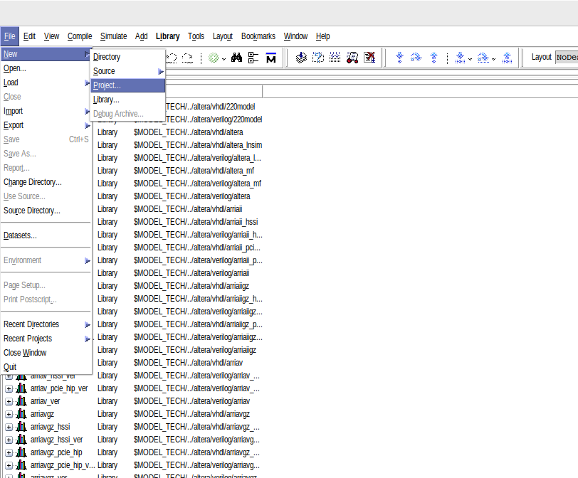
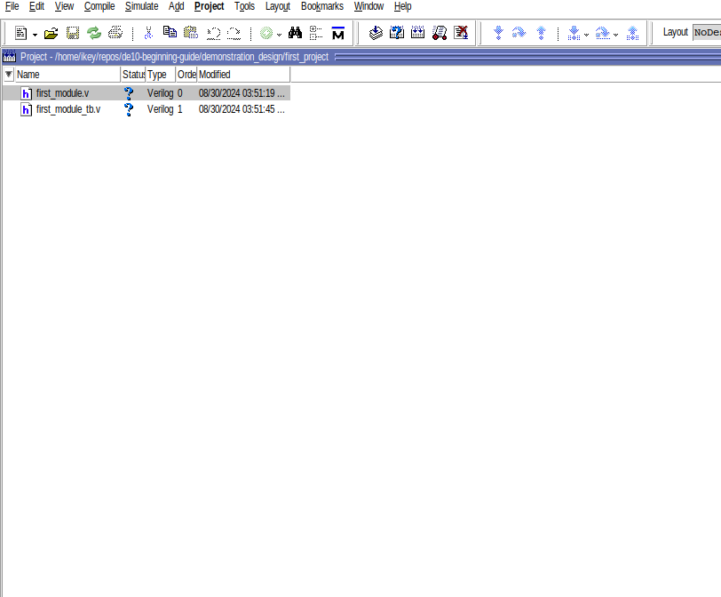

# Part 1: First Design and Simulation

## Installation
First things first, we need to download a verilog simulator. For this tutorial, we will be using [ModelSim] (https://www.intel.com/content/www/us/en/software-kit/750666/modelsim-intel-fpgas-standard-edition-software-version-20-1-1.html) (link is for both Windows and Linux).

Make the installer executable:

```chmod +x ModelSimSetup-20.1.1.720-linux.run```

Run the installer and install ModelSim:

```./ModelSimSetup-20.1.1.720-linux.run ```

Install ModelSim into the `/opt` directory.

To use these tools from your command line, add the following line to either `.bashrc` or `.zshrc`.

``` export PATH=$PATH:/opt/modelsim_ase/bin ```

## First Digital Design
Run this command to open up ModelSim:

```vsim```

Create a project like so and name it whatever you want:



Create two new files and add them to your project:


One file will represent the module we are designing and the other one will be a testbench.
A testbench is just a simulated environment to test our design to see if it is working.


## Table of Contents
- [Simulation](./1_simulation.md)
- [Synthesis](./2_synthesis.md)