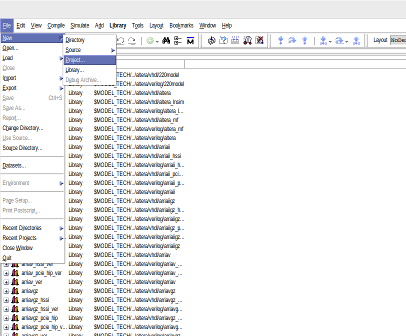
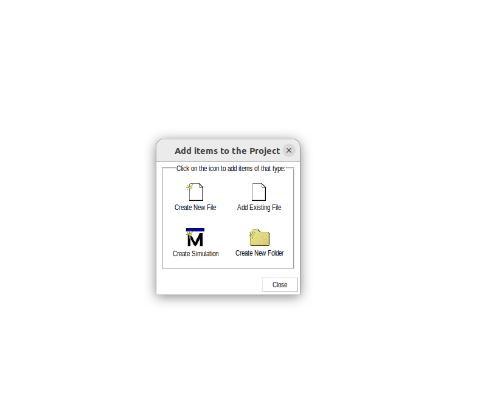
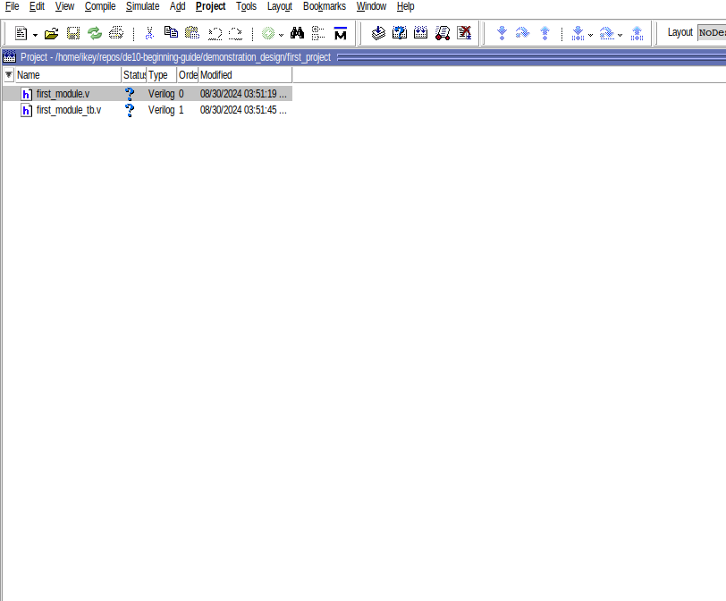

# Part 2: First Design

## First Module

Run this command to open up ModelSim:

```vsim```

Before creating a project, to create a folder to contain your project in your home directory (or anywhere you keep your projects on your computer).

```mkdir ~/first_module```

Create a project in your directory and name it whatever you want:



Create two new Verilog files and add them to your project:




One file will represent the module we are designing and the other one will be a testbench.
A testbench is just a simulated environment to test our design to see if it is working.


We will first start by writing your first module and then testing it's functionality using the testbench.
The design we will be creating first is a logic block that will turn certain LEDs on depending on which button on the FPGA is currently being pressed.

Start by adding these lines to your module file:
```
`timescale 1us/100ns

module first_module(input button1,
                   input button2,
                   output [9:0] oleds); 
```

Let's dissect what exactly we are doing here. Firstly, `timescale 1us/100ns` refers to the scale and precision at which are you are going to do your simulation.

The `1us` refers to the length of your time delays being used in the simulation. For example, in the line of Verilog code `assign #(1) var2 = var1;`, `#(1)` refers to how long the delay will in number of time units to assign the value of `var1` to the value `var2`. So, if the `1us` is the length of a single time delay, `var1` will be assigned to `var2` after `1us`. Delays like this are only necessary for simulation to in order to simulate accurate delays of signals. When delays are not specified, the simulator changes values instantly (which is not realistic for how the logic will work on the hardware).

The `100ns` refers to the length of the discrete units of time used to simulate your model. In a simulation, time needs to be discrete instead of continuous. Hence, `100ns` means that the simulation will be stepped through at intervals of `100ns`.

Finally, `module first_module(input button1, input button2, output [9:0] leds); ` is the head of the module we are creating. From a computer programmers perspective, module headers look and behave in the same way function headers work in languages such as Java, Python, or C.
Modules are first defined by using the keywork `module` followed by the name of the module. In our case, this looks like `module first_module`. Following this, a list of required arguments is defined. In this list of arguments, you must define the names of the arguments and optionally whether they are inputs to your module or outputs. In our example, you can see we have labeled `button1` and `button2` as inputs to our modules. Likewise, we have labled `leds` as an output to our module. Speaking of `leds`. I'm sure you've noticed the strange `[9:0]`, don't worry about that right at this second, we will get to that once we write the body of our module.


Now add these lines of code to your module file:
```
reg [9:0] leds;

assign oleds = leds;

always @(button1 or button2) begin
    if (button1) begin
	    leds[0] <= 1'b1;
	    leds[2] <= 1'b1;
	    leds[4] <= 1'b1;
	    leds[6] <= 1'b1;
	    leds[8] <= 1'b1;
        end
        else begin
	    leds[0] <= 1'b0;
	    leds[2] <= 1'b0;
	    leds[4] <= 1'b0;
	    leds[6] <= 1'b0;
	    leds[8] <= 1'b0;
	end
	if (button2) begin
	    leds[1] <= 1'b1;
	    leds[3] <= 1'b1;
	    leds[5] <= 1'b1;
	    leds[7] <= 1'b1;
	    leds[9] <= 1'b1;
        end
	else begin
	    leds[1] <= 1'b0;
	    leds[3] <= 1'b0;
	    leds[5] <= 1'b0;
	    leds[7] <= 1'b0;
	    leds[9] <= 1'b0;
	end
end
```

Firstly, before we go into any more detail about this code, we will discuss Verilog "data types":
- `wire`: `wire` types are used to connect different components of modules. They can be treated as physical wires on a circuit. No values get stored in them and they have to be driven by a continuous assign statement or from a port of a module. In our example code, `button1`, `button2`, and `oleds` are wires.
- `reg`: Contrary to their name, `reg` types are not actually physically regsiters. Instead, they represent a data storage element in Verilog. They keep value given to them until it is changed. When synthesized into hardware, they can be flip-flops, latches, or even just combinatorial logic. In our example code, `led` is a `reg` data type.

One more thing to clear up before we continue is buses in Verilog. Buses in Verilog are created like this: `reg [9:0] example1` or `wire [4:0] example2`. From a computer programmers perspective, they act exactly like an array in either Java or C.

With those couple of things out of the way, lets get into what we are doing in that block of code above. First, we create `reg [9:0] leds` which is a register bus of size 10. Then we assign the values of `leds` to `oleds` with `assign oleds = leds`. 

Then there is `always @(button1 or button2)`. `always` blocks are blocks of logic that are only performed when certain events or conditions are met. The events the `always` block is sensitive to will be listed inbetween the parathesis of `@(...)`. In our example, the always statements will execute only if `button1` or `button2` change values.

Finally, the block of logic inside the `always` statement executed are just simple if-else statements for assigning certain values to certain values depending on the values gotten from the `button1` and `button2` signals. If the `button1` signal is 1, then the all of the odd leds will bet set to 1.
If the `button2` signal is 1, then all of the even leds will be set to 1.

To finish the design, you end the module with a `endmodule` statement.

At the end of this, your module should look like:
```
`timescale 1us/100ns

module first_module(input wire button1,
                    input wire button2,
                    output wire [9:0] oleds);

    reg [9:0] leds;

    assign oleds = leds;

    always @(button1 or button2) begin
        if (button1) begin
	    leds[0] <= 1'b1;
	    leds[2] <= 1'b1;
	    leds[4] <= 1'b1;
	    leds[6] <= 1'b1;
	    leds[8] <= 1'b1;
        end
        else begin
	    leds[0] <= 1'b0;
	    leds[2] <= 1'b0;
	    leds[4] <= 1'b0;
	    leds[6] <= 1'b0;
	    leds[8] <= 1'b0;
	end
	if (button2) begin
	    leds[1] <= 1'b1;
	    leds[3] <= 1'b1;
	    leds[5] <= 1'b1;
	    leds[7] <= 1'b1;
	    leds[9] <= 1'b1;
        end
	else begin
	    leds[1] <= 1'b0;
	    leds[3] <= 1'b0;
	    leds[5] <= 1'b0;
	    leds[7] <= 1'b0;
	    leds[9] <= 1'b0;
	end
   end
endmodule
```

The module can also be found in the [first_module.v](./demonstration_design/first_module.v).

## First Testbench

We will now cover how to write a testbench in order to test our module in simulation.

Open up your testbench file and add the following lines to it:

```
`timescale 1us/100ns

module first_module_tb();
    reg button1;
    reg button2;

    wire [9:0] leds;

    first_module fm (.button1(button1), .button2(button2), .oleds(leds));
```

We have covered most of the Verilog syntax in the previous section but we have not covered how to use other Verilog modules in another module.
You can use another Verilog moulde in your module with the following syntax: `module_name module_instance_name (.arg1(incoming_arg1), arg2(incoming_arg2), ...)`. An example of this is the following in the previous code we have seen: `first_module fm (.button1(button1), .button2(button2), .oleds(leds))`. 

Next, put the following lines into your file:
```
initial begin
        button1 = 0;
        button2 = 0; 
        #5;
        button1 = 1;
        #10;
        button2 = 1;
        #10;
	    $finish;
    end

endmodule
```

The following sequence is our test sequence in order to test it's functionality. The `button1` and `button2` signal will first both be set to 0.
The value of `leds` should be `0b0000000000`.
The simulation will then wait the length of 5 delays, then set `button1` to 1. The value of `leds` should turn to `0b0101010101`.
The simulation will then wait the length of 10 delays, then set `button2` to 1 also. The values of `leds` should then turn `0b1111111111`.


## Table of Contents
- [Intro](./0_intro.md)
- [ModelSim Install](./1_modelsim_install.md)
- [First Design](./2_first_design.md)
- [Simulation](./3_simulation.md)
- [Quartus Install](./4_quartus_install.md)
- [Synthesis](./5_synthesis.md)
