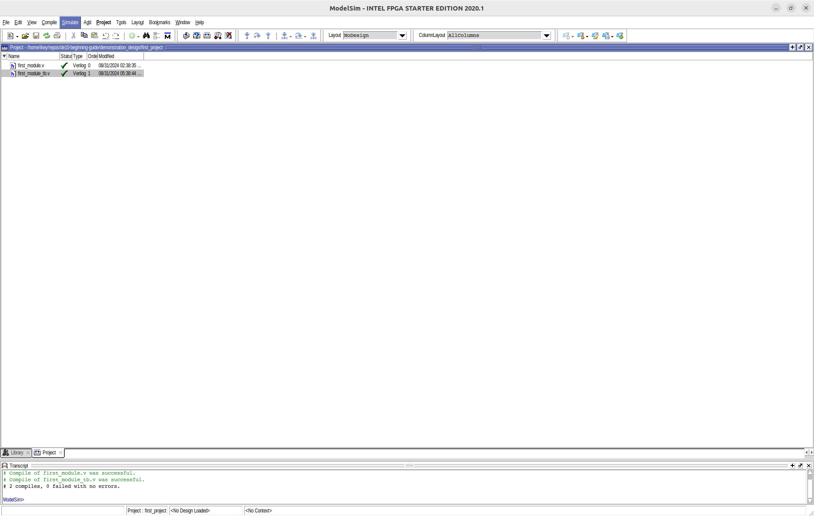
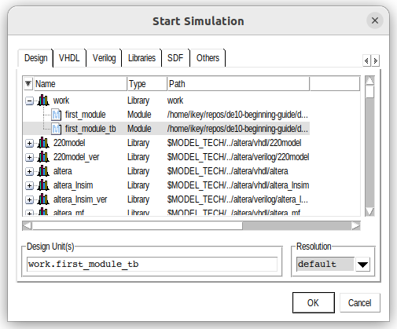
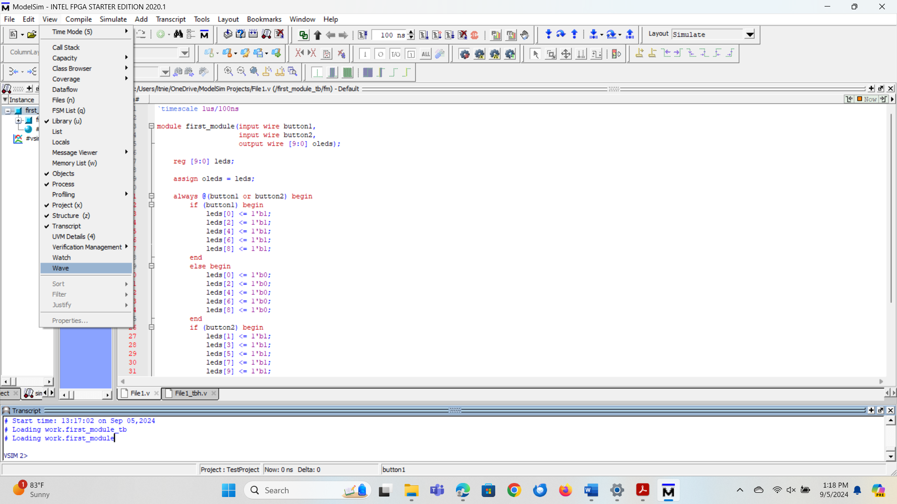
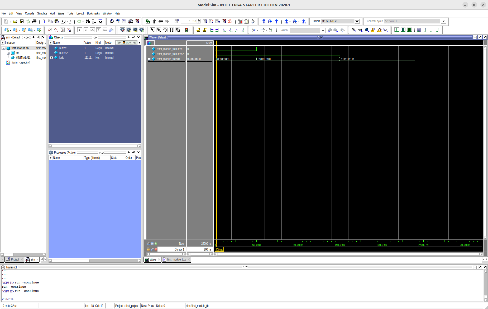

# Simulation

Now that we have a design we can test and a testbench to to test it, it's time to simulate!

To compile your modules, press the 'Compile All' button on the top toolbar.

Then, press the 'Simulate' button at the very top (illustrated below) and click the 'Start Simulation' button.

You then should get a menu that look like this:

Click on your testbench file to begin simulation.

If your signal display window or 'Wave window' is not open right now, you can press the 'View' tab at the top and press the 'Wave' buttom to open the window.

To view signals, you can drag the signal objects from the Objects panel to the Wave window to see their output.

You can then step through the simulation by pressing the 'Run' button a couple times.

It might not look exactly like mine, but if you change the zoom of your Wave window you should get something close to this:

## Table of Contents
- [Intro](./0_intro.md)
- [ModelSim Install](./1_modelsim_install.md)
- [First Design](./2_first_design.md)
- [Simulation](./3_simulation.md)
- [Quartus Install](./4_quartus_install.md)
- [Synthesis](./5_synthesis.md)