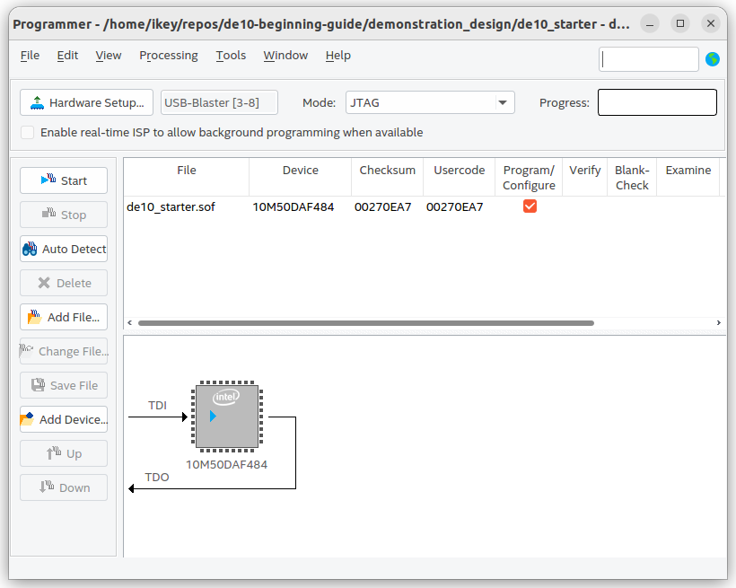
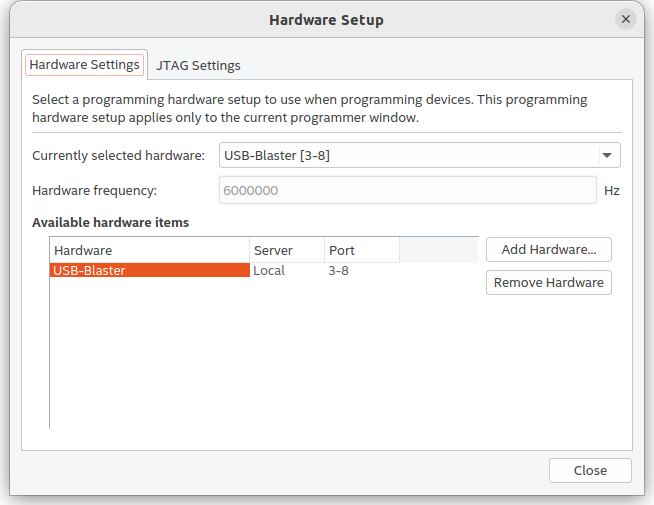
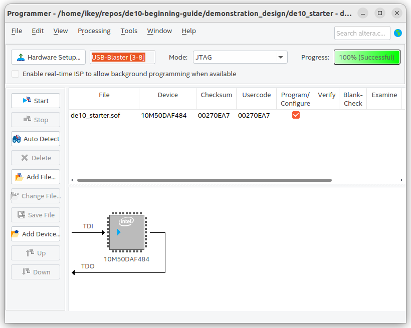

# Part 5: Synthesis

Now let's actually put our design on an FPGA!


Start by opening up Quartus:
```quartus```

Then make note of the following files in `de10-beginning-guide/template_code`:
- `template_project.v`
- `template_project.sdc`
- `template_project.qsf`
- `template_project.qpf`

These are top level design files specifcally for the DE10 Lite by Terasic.

We need all of these in order to flash our design onto the FPGA.

Download and move these files to your project directory.

Now open up the quartus project file `template_project.qpf` by pressing the 'File' button and selecting 'Open Project'.

**Then add your Verilog file for your first design (mine would be first_module.v) to the project by clicking on the 'Project' button on top and selecting 'Add/Remove Files In Project'. Do not add your testbench file.**

After that, open up `template_project.v`, it should look something like this:

```
//=======================================================
//  This code is generated by Terasic System Builder
//=======================================================

module template_project(

	//////////// CLOCK //////////
	input 		          		ADC_CLK_10,
	input 		          		MAX10_CLK1_50,
	input 		          		MAX10_CLK2_50,

	//////////// SDRAM //////////
	output		    [12:0]		DRAM_ADDR,
	output		     [1:0]		DRAM_BA,
	output		          		DRAM_CAS_N,
	output		          		DRAM_CKE,
	output		          		DRAM_CLK,
	output		          		DRAM_CS_N,
	inout 		    [15:0]		DRAM_DQ,
	output		          		DRAM_LDQM,
	output		          		DRAM_RAS_N,
	output		          		DRAM_UDQM,
	output		          		DRAM_WE_N,

	//////////// SEG7 //////////
	output		     [7:0]		HEX0,
	output		     [7:0]		HEX1,
	output		     [7:0]		HEX2,
	output		     [7:0]		HEX3,
	output		     [7:0]		HEX4,
	output		     [7:0]		HEX5,

	//////////// KEY //////////
	input 		     [1:0]		KEY,

	//////////// LED //////////
	output		     [9:0]		LEDR,

	//////////// SW //////////
	input 		     [9:0]		SW,

	//////////// VGA //////////
	output		     [3:0]		VGA_B,
	output		     [3:0]		VGA_G,
	output		          		VGA_HS,
	output		     [3:0]		VGA_R,
	output		          		VGA_VS,

	//////////// Accelerometer //////////
	output		          		GSENSOR_CS_N,
	input 		     [2:1]		GSENSOR_INT,
	output		          		GSENSOR_SCLK,
	inout 		          		GSENSOR_SDI,
	inout 		          		GSENSOR_SDO,

	//////////// Arduino //////////
	inout 		    [15:0]		ARDUINO_IO,
	inout 		          		ARDUINO_RESET_N,

	//////////// GPIO, GPIO connect to GPIO Default //////////
	inout 		    [35:0]		GPIO
);


//=======================================================
//  REG/WIRE declarations
//=======================================================


//=======================================================
//  Structural coding
//=======================================================


endmodule
```

Call your first design module from this file like so:

```
//=======================================================
//  This code is generated by Terasic System Builder
//=======================================================

module template_project(

	//////////// CLOCK //////////
	input 		          		ADC_CLK_10,
	input 		          		MAX10_CLK1_50,
	input 		          		MAX10_CLK2_50,

	//////////// SDRAM //////////
	output		    [12:0]		DRAM_ADDR,
	output		     [1:0]		DRAM_BA,
	output		          		DRAM_CAS_N,
	output		          		DRAM_CKE,
	output		          		DRAM_CLK,
	output		          		DRAM_CS_N,
	inout 		    [15:0]		DRAM_DQ,
	output		          		DRAM_LDQM,
	output		          		DRAM_RAS_N,
	output		          		DRAM_UDQM,
	output		          		DRAM_WE_N,

	//////////// SEG7 //////////
	output		     [7:0]		HEX0,
	output		     [7:0]		HEX1,
	output		     [7:0]		HEX2,
	output		     [7:0]		HEX3,
	output		     [7:0]		HEX4,
	output		     [7:0]		HEX5,

	//////////// KEY //////////
	input 		     [1:0]		KEY,

	//////////// LED //////////
	output		     [9:0]		LEDR,

	//////////// SW //////////
	input 		     [9:0]		SW,

	//////////// VGA //////////
	output		     [3:0]		VGA_B,
	output		     [3:0]		VGA_G,
	output		          		VGA_HS,
	output		     [3:0]		VGA_R,
	output		          		VGA_VS,

	//////////// Accelerometer //////////
	output		          		GSENSOR_CS_N,
	input 		     [2:1]		GSENSOR_INT,
	output		          		GSENSOR_SCLK,
	inout 		          		GSENSOR_SDI,
	inout 		          		GSENSOR_SDO,

	//////////// Arduino //////////
	inout 		    [15:0]		ARDUINO_IO,
	inout 		          		ARDUINO_RESET_N,

	//////////// GPIO, GPIO connect to GPIO Default //////////
	inout 		    [35:0]		GPIO
);


//=======================================================
//  REG/WIRE declarations
//=======================================================


//=======================================================
//  Structural coding
//=======================================================

    first_module fm (.button1(KEY[0]), .button2(KEY[1]), .oleds(LEDR));

endmodule
```

Then compile the design by pressing "Start Compilation".

After it is finished compiling you're design, press the "Tools" button at the top and select Programmer.
You should see something close to this:



Then press the "Hardware Setup" button and select USBBlaster as your hardware:



Finally, press the "Start" button to start flashing your FPGA.
If it is successful, you will recieve a screen like so:




## Table of Contents
- [Intro](./0_intro.md)
- [ModelSim Install](./1_modelsim_install.md)
- [First Design](./2_first_design.md)
- [Simulation](./3_simulation.md)
- [Quartus Install](./4_quartus_install.md)
- [Synthesis](./5_synthesis.md)